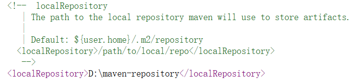
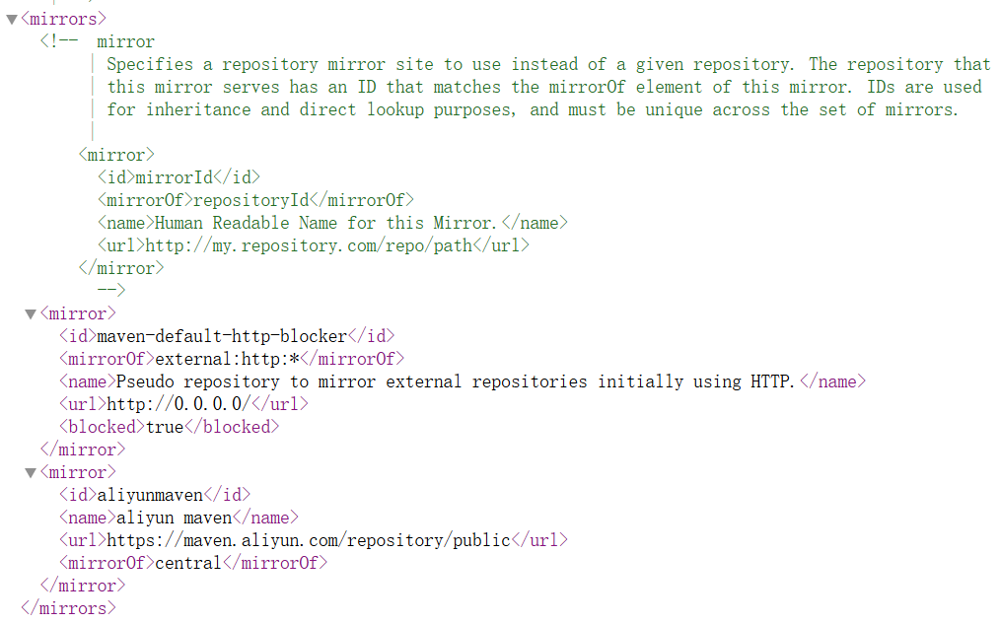
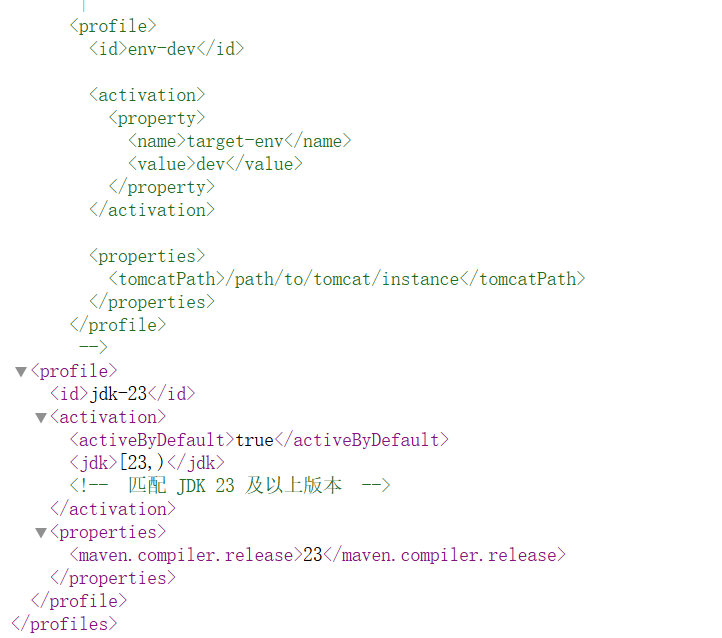

## Maven配置

#### Maven配置仓库



找到localRepository标签，如图中配置

```html
<localRepository>D:\maven-repository</localRepository>
```


#### Maven镜像配置



找到mirrors标签，如图中配置

```html
<mirror>
<id>aliyunmaven</id>
<name>aliyun maven</name>
<url>https://maven.aliyun.com/repository/public</url>
<mirrorOf>central</mirrorOf>
</mirror>
```

#### JDK配置



找到profiles标签，配置如下(我此处JDK为23版本，具体配使用者JDK的版本)

```html
<profile>
<id>jdk-23</id>
<activation>
<activeByDefault>true</activeByDefault>
<jdk>[23,)</jdk>
<!--  匹配 JDK 23 及以上版本  -->
</activation>
<properties>
<maven.compiler.release>23</maven.compiler.release>
</properties>
</profile>
```

