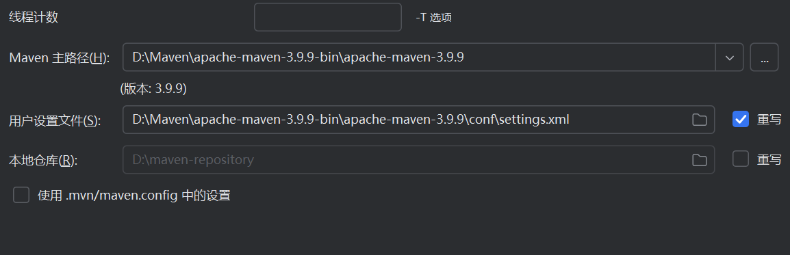

# TestRepository3
## 环境配置

该项目要求使用自配Maven,在官网Maven[Welcome to Apache Maven – Maven](https://maven.apache.org/)中选择Downloads Maven的3.9.9版本,安装好之后需要配置环境变量，请在系统变量中新增，变量名MAVEN_HOME,值则为安装maven的路径，到apache-maven-3.9.9即可，接着需要配置Maven,在apache-maven-3.9.9目录下--conf--settings.xml，请按照文档中Maven配置中进行配置。

然后在idea中克隆该项目，在项目中选择文件--设置--构建，执行，部署--构建工具--Maven下配置Maven主路径和用户设置文件。

接着需要同步你的所有Maven项目，然后就可以运行程序了。

